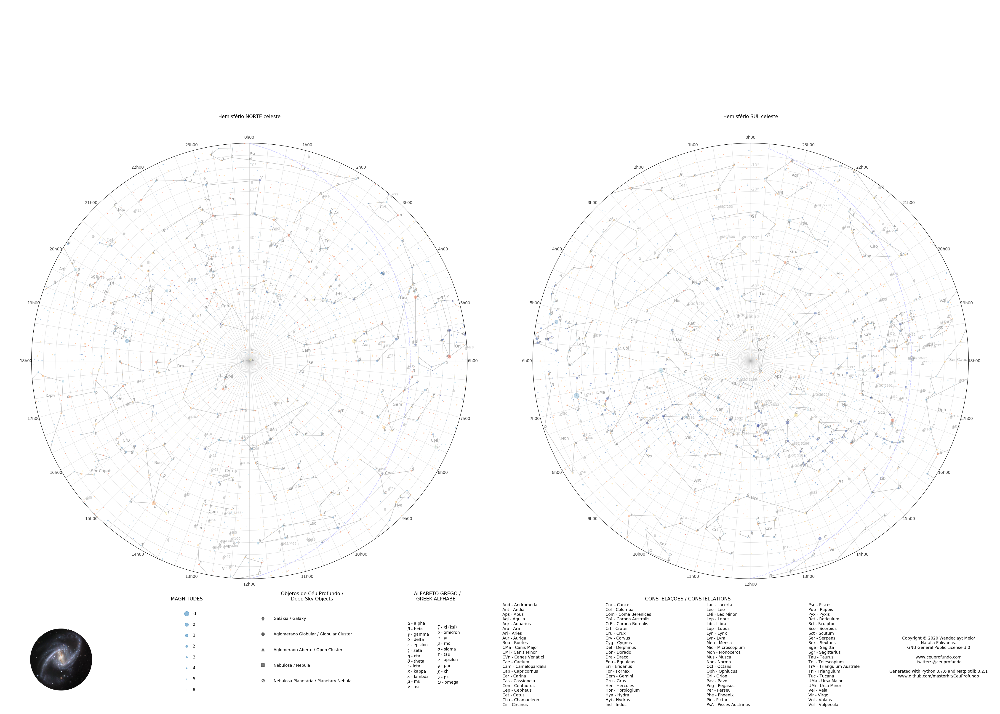
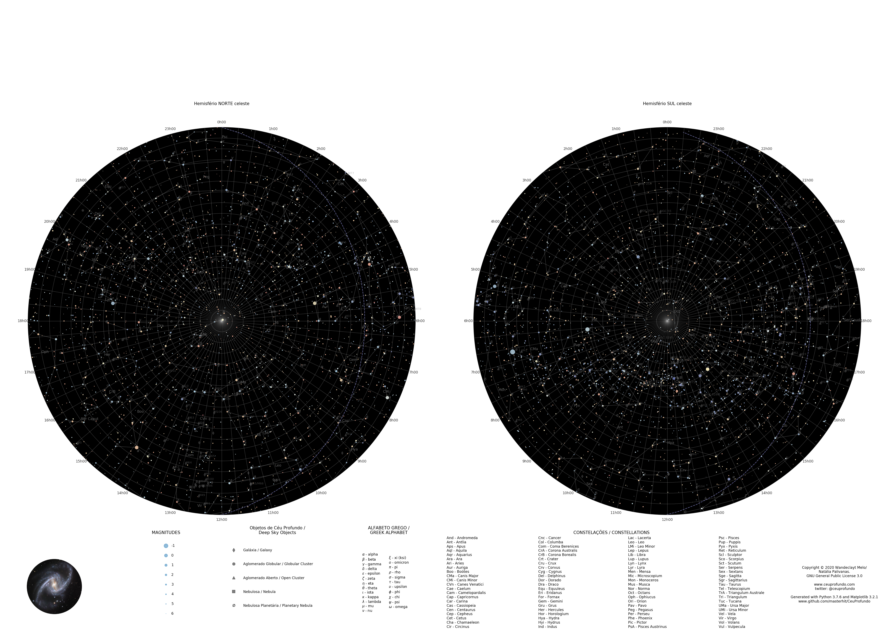

# CeuProfundo v 0.5.0



[PT-BR]
**CeuProfundo** é um *script* em Python 3 para plotagem de cartas celestes retangulares e polares utilizando
dados de catálogos estelares e de objetos de céu profundo.
O tamanho e a resolução são ajustáveis para visualização e impressão.
A exibição de estrelas e objetos celestes pode ser desabilitada, criando
cartas em branco que podem ser utilizadas em atividades educacionais.
 
[EN]
**CeuProfundo** is a Python 3 script to plot sky charts in rectangular and polar modes with data 
from star and deep sky objects catalogs.
Size and resolution can be adjusted for viewing or printing.
Star and DSO exhibition can be toggled off to generate blank templates for
educational purposes.

### Apresentação:

Aplicativos de celular para identificação do céu são úteis, mas possuem a limitação de mostrar apenas um pequeno campo do céu, reduzindo a consciência situacional do observador. Um objeto astronômico muito interessante pode estar ali do lado, muito próximo da região para onde você está olhando, mas não vai ser exibido pelo aplicativo.

Acreditamos que um mapa celeste, compreendendo todo o céu, seja indispensável para quem deseja conhecer a esfera celeste e se familiarizar com as constelações e os objetos de céu profundo nelas abrigados. No entanto, cartas celestes neste formato não são encontradas facilmente. Por isto desenvolvemos um *script* que constrói, a partir de catálogos estelares e de objetos do céu profundo, uma carta celeste que pode ser impressa e utilizada como ferramenta de planejamento na observação do céu, como recurso pedagógico em salas de aula ou mesmo transformada em pôster.

O catálogo estelar utilizado é o *Bright Star Catalog 5th Edition, Preliminary (BSC5P)* com estrelas até magnitude 6.5.
Os objetos de céu profundo incluem os catálogos Messier e Caldwell, populares entre amadores e observáveis através de instrumentos modestos. Esta escolha de catálogos torna estas cartas particularmente interessantes para astrônomos amadores com pequenos telescópios (ou mesmo instrumentos mais robustos) que desejem explorar objetos mais desafiadores que a Lua e os Planetas.

A principal apresentação das cartas é em forma de um mapa duplo, com os hemisférios celestes sul e norte em gráficos polares. Os hemisférios também podem ser gerados individualmente e uma apresentação retangular limitada entre as declinações +65º e -65º também está implementada.

Os arquivos gerados são salvos em formato PDF por padrão e, opcionalmente, em formato PNG.

### Instruções:

* Baixe e salve locamente os arquivos deste repositório.
* Você precisará ter o  instalado com os pacotes [NumPy](https://numpy.org/), [Pandas](https://pandas.pydata.org/) e [Matplotlib](https://matplotlib.org/). A distribuição [Anaconda](https://www.anaconda.com/products/individual) inclui todos os pacotes necessários.
* Execute o *script* a partir da linha de comando, no diretório onde os arquivos foram salvos.
    Para ver os argumentos opcionais use:
    ```
    python CeuProfundo.py --h
    ```
* Argumentos opcionais:
    ```
  -h, --help        Exibe esta mensagem.
  -v, --version     Exibe a versão do programa.
  -S, --Stars       Plota cartas com estrelas.
  -M, --Messier     Plota cartas com objetos dos catálogos Messier e Caldwell.
  -D, --Dark        Usa fundo escuro.
  -r, --retangular  Plota carta retangular.
  -s, --sul         Plota carta polar sul.
  -n, --norte       Plota carta polar norte.
  -d, --dupla       Plota carta polar norte e sul.
  -g, --png         Muda extensão do arquivo de saída para .png.
    ```
* Exemplos.
    * Para gerar a carta dupla em pdf, com os hemisférios norte e sul em fundo claro, incluindo as estrelas do Bright Star Catalogue e os objetos de céu profundo dos catálogos Messier e Caldwell:
    ```
    python CeuProfundo.py -S -M -d
    ```
    
    * Para gerar a carta dupla em png, com os hemisférios norte e sul em fundo escuro, incluindo as estrelas do Bright Star Catalogue e os objetos de céu profundo dos catálogos Messier e Caldwell:
    ```
    python CeuProfundo.py -S -M -D -d -g
    ```
    
    

    * Para gerar a carta retangular em pdf, com fundo escuro, incluindo as estrelas do Bright Star Catalogue e os objetos de céu profundo dos catálogos Messier e Caldwell:
    ```
    python CeuProfundo.py -S -M -D -r
    ```
    
    
